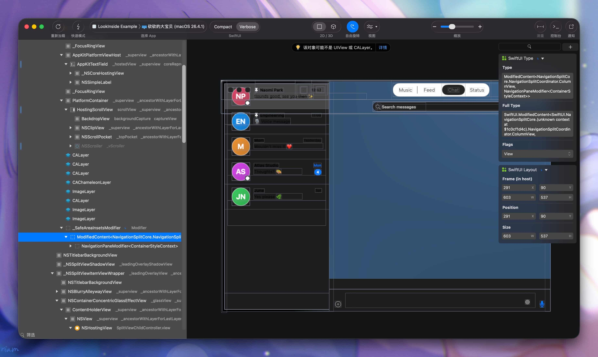

# LookInside

A macOS UI inspector for debuggable macOS and iOS apps. Click a view, see its layer tree, frames, and resolved properties live.



- Website · [lookinside-app.com](https://lookinside-app.com)
- Swift Package · [LookInside-Server](https://github.com/LookInsideApp/LookInside-Server)

LookInside is a community continuation of [Lookin](https://lookin.work/).

---

## How it works (at a glance)

```
┌────────────┐    Peertalk over TCP loopback / USB    ┌───────────────┐
│ LookInside │ ◄────── 47164–47179 (per platform) ──► │  Your app     │
│  (macOS)   │       NSKeyedArchiver framing          │ + LookinServer│
└────────────┘                                        └───────────────┘
```

1. You embed [LookInside-Server](https://github.com/LookInsideApp/LookInside-Server) into the app you want to inspect (debug builds only).
2. You launch LookInside on your Mac.
3. LookInside auto-discovers running targets — macOS apps, iOS Simulator apps, USB-connected iOS devices.
4. You click into the live view hierarchy.

---

## Get started

### 1. Install

Grab a notarized build from the [Releases page](https://github.com/LookInsideApp/LookInside/releases).

### 2. Embed the server in your app

See [LookInside-Server](https://github.com/LookInsideApp/LookInside-Server) for the SwiftPM / CocoaPods integration. It only links into debug configurations and is wire-compatible with upstream Lookin.

### 3. Run and inspect

Launch LookInside, run your debug build, pick the target from the sidebar.

---

## License

GPL-3.0 — see [`LICENSE`](LICENSE).

